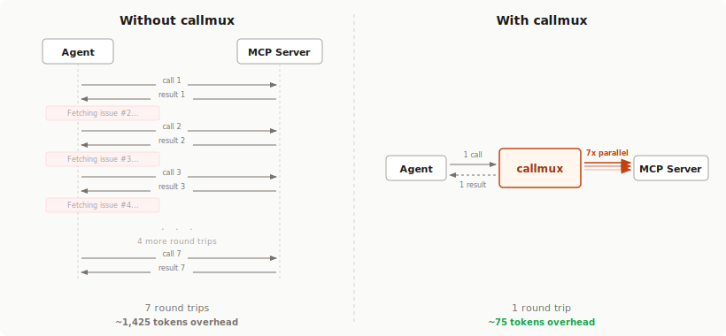

<div align="center">
  <h1>callmux</h1>
  <p>
    <strong>Parallel execution, batching, caching, pipelining, and tool management for any MCP server.</strong>
  </p>
  <p>
    <a href="https://www.npmjs.com/package/callmux"></a>
    <a href="https://opensource.org/licenses/MIT"></a>
    <a href="https://www.npmjs.com/package/callmux"></a>
  </p>
</div>

---

AI agents make tool calls one at a time. Creating 10 GitHub issues? That's 10 sequential round-trips. Fetching data from 3 different servers? 3 serial waits.

**callmux sits between your agent and any MCP server**, adding capabilities the original doesn't have:

| Without callmux | With callmux |
|:---|:---|
| 10 sequential `create_issue` calls | 1 `callmux_batch` call |
| 5 independent reads, one after another | 1 `callmux_parallel` call |
| Read > transform > write chain | 1 `callmux_pipeline` call |
| Same data fetched 3 times per session | Cached after first call |
| 40+ tools bloating the system prompt | 6 meta-tools via meta-only mode |

<p align="center">
  
</p>

## Why Tool Call Reduction Matters

Every tool call adds structural overhead (~75 tokens) and intermediate reasoning (~150 tokens of "Now I'll fetch the next one...") to your context window. Batch 7 calls into 1 and you eliminate **~1,350 tokens of pure waste** -- a 19:1 reduction in context pollution. Since context is cumulative (every turn re-processes everything before it), this compounds across a session.

In practice, callmux reduces tool calls to ~15% of the original count. Sessions run longer before compaction, cost less in API tokens, and produce better output because the model isn't re-reading filler from 40 turns ago.

[Deep dive on the context math with diagrams](https://longgamedev.substack.com/p/your-ai-agent-is-re-reading-its-own)

---

## Features

- **Parallel execution** -- fire independent tool calls concurrently, get all results in one turn
- **Batch operations** -- same tool, many items, one call (bulk create, bulk fetch)
- **Pipelining** -- chain tools where each step feeds into the next via input mapping
- **Caching** -- TTL-based result cache with wildcard allow/deny policies, per-server overrides
- **Meta-only mode** -- hide all downstream tools from the agent's listing, expose only 6 meta-tools. Keeps the system prompt fixed-size regardless of how many servers you connect
- **Multi-server** -- wrap multiple MCP servers through one callmux instance with automatic namespacing
- **Tool scoping** -- whitelist which tools each server exposes. Gives any MCP client per-server tool filtering, even if the client doesn't support it natively (Codex, Cursor, Windsurf, etc.)
- **Per-server concurrency** -- protect fragile downstreams with per-server call limits alongside the global concurrency cap
- **Degraded startup** -- servers that fail to connect are skipped instead of blocking startup, with full diagnostics in `callmux_status`
- **Multi-transport** -- local stdio, Streamable HTTP, and SSE with auto-fallback
- **Config schema** -- JSON Schema for editor autocomplete and validation (`$schema` auto-injected)
- **Zero config** -- wrap any server with one `npx` command, or use the interactive setup wizard

---

## Install

No install needed. Use `npx`:

```bash
npx -y callmux -- npx -y @modelcontextprotocol/server-github
```

Or install globally:

```bash
npm install -g callmux
```

## Quick Start

### Claude Code

Add to `~/.claude.json` or project `.mcp.json`:

```json
{
  "mcpServers": {
    "github": {
      "command": "npx",
      "args": ["-y", "callmux", "--", "npx", "-y", "@modelcontextprotocol/server-github"]
    }
  }
}
```

Done. Claude now sees all GitHub tools plus the `callmux_*` meta-tools.

<details>
<summary><strong>More:</strong> tool filtering, caching, env vars, multi-server</summary>

**Filter tools and enable caching:**

```json
{
  "mcpServers": {
    "github": {
      "command": "npx",
      "args": [
        "-y", "callmux",
        "--tools", "create_issue,get_issue,list_issues,search_issues",
        "--env", "GITHUB_TOKEN=ghp_xxx",
        "--cache", "60",
        "--cache-allow", "get_*,list_*,search_*",
        "--", "npx", "-y", "@modelcontextprotocol/server-github"
      ]
    }
  }
}
```

**Multiple servers via config file:**

Create `~/.config/callmux/config.json` (or run `callmux setup`):

```json
{
  "servers": {
    "github": {
      "command": "npx",
      "args": ["-y", "@modelcontextprotocol/server-github"],
      "env": { "GITHUB_TOKEN": "ghp_xxx" },
      "tools": ["create_issue", "get_issue", "list_issues", "search_issues"]
    },
    "linear": {
      "command": "npx",
      "args": ["-y", "@linear/mcp-server"],
      "env": { "LINEAR_API_KEY": "lin_api_..." }
    }
  },
  "cacheTtlSeconds": 60,
  "maxConcurrency": 20,
  "maxCacheEntries": 1000,
  "connectTimeoutMs": 30000,
  "callTimeoutMs": 30000,
  "strictStartup": false
}
```

Then in your MCP config:

```json
{
  "mcpServers": {
    "callmux": {
      "command": "npx",
      "args": ["-y", "callmux"]
    }
  }
}
```

callmux auto-discovers `~/.config/callmux/config.json`. With multiple servers, tools are namespaced: `github__create_issue`, `linear__list_issues`.

</details>

---

### Codex

Add to `~/.codex/config.toml`:

```toml
[mcp_servers.github]
command = "npx"
args = ["-y", "callmux", "--", "npx", "-y", "@modelcontextprotocol/server-github"]
```

Or use the Codex CLI:

```bash
codex mcp add github -- npx -y callmux -- npx -y @modelcontextprotocol/server-github
```

<details>
<summary><strong>More:</strong> tool filtering, caching, env vars, multi-server</summary>

```toml
[mcp_servers.github]
command = "npx"
args = [
  "-y", "callmux",
  "--tools", "create_issue,get_issue,list_issues,search_issues",
  "--env", "GITHUB_TOKEN=ghp_xxx",
  "--cache", "60",
  "--cache-allow", "get_*,list_*,search_*",
  "--", "npx", "-y", "@modelcontextprotocol/server-github"
]
```

**Multi-server:**

```toml
[mcp_servers.callmux]
command = "npx"
args = ["-y", "callmux", "--config", "/Users/you/.config/callmux/config.json"]
```

The Codex macOS app, CLI, and IDE extension all share `~/.codex/config.toml`. Project-scoped overrides go in `.codex/config.toml`.

</details>

---

### Claude Desktop (Mac / Windows)

Add to your `claude_desktop_config.json`:

- **macOS:** `~/Library/Application Support/Claude/claude_desktop_config.json`
- **Windows:** `%APPDATA%\Claude\claude_desktop_config.json`

```json
{
  "mcpServers": {
    "callmux": {
      "command": "npx",
      "args": ["-y", "callmux", "--", "npx", "-y", "@modelcontextprotocol/server-github"]
    }
  }
}
```

<details>
<summary><strong>More:</strong> PATH issues, multi-server</summary>

The Claude desktop app has a minimal PATH. If `npx` isn't found, use the full path (e.g., `/usr/local/bin/npx`). Find it with `which npx`. Or install globally and use `"command": "callmux"` directly.

Multi-server works the same way as Claude Code. Point at a config file or let auto-discovery find it.

</details>

---

## Interactive Setup

The fastest way to go from zero to configured:

```bash
npx -y callmux setup
```

The wizard walks you through:
1. **Detects existing MCP servers** from `.mcp.json`, `~/.claude.json`, and Claude Desktop config, then offers to import them
2. **Pick servers** from a curated list (GitHub, Linear, Slack, Filesystem, etc.) or add custom (local command or remote URL)
3. **Auto-discovers tools** by probing each server, then lets you pick which to expose
4. **Configures caching** with sensible defaults
5. **Offers meta-only mode** to hide proxied tools and reduce system prompt size
6. **Attaches to your client** (Claude Code, Codex) automatically

---

## Meta-Tools

These are exposed to your agent alongside the proxied tools:

### `callmux_parallel`

Execute multiple independent tool calls concurrently.

```json
{
  "calls": [
    { "tool": "get_issue", "arguments": { "number": 1 } },
    { "tool": "get_issue", "arguments": { "number": 2 } },
    { "tool": "get_issue", "arguments": { "number": 3 } }
  ]
}
```

### `callmux_batch`

Same tool, many items. The bulk operation pattern.

```json
{
  "tool": "create_issue",
  "items": [
    { "arguments": { "title": "Bug A", "labels": ["bug"] } },
    { "arguments": { "title": "Bug B", "labels": ["bug"] } }
  ]
}
```

### `callmux_pipeline`

Chain tools where each step feeds into the next.

```json
{
  "steps": [
    { "tool": "search_issues", "arguments": { "query": "is:open label:bug" } },
    { "tool": "analyze", "arguments": {}, "inputMapping": { "data": "$json" } }
  ]
}
```

### `callmux_cache_clear`

Invalidate cached results. Scope by tool, server, or clear everything.

```json
{ "tool": "get_issue", "server": "github" }
```

### `callmux_call`

Call a single downstream tool by name. Primary invocation path in [meta-only mode](#meta-only-mode).

```json
{ "tool": "get_issue", "server": "github", "arguments": { "number": 42 } }
```

### `callmux_status`

Introspect callmux from inside your agent. Shows connected servers, failed startup servers, available tools, cache state, and mode. Pass `descriptions: true` for tool discovery in meta-only mode.

```json
{ "server": "github", "descriptions": true, "descriptionMaxLength": 80 }
```

---

## Multi-Server Mode

Wrap multiple MCP servers through a single callmux instance. Tools are automatically namespaced (`github__create_issue`, `linear__list_issues`) and the `server` field in meta-tool calls lets you target specific servers:

```json
{
  "calls": [
    { "server": "github", "tool": "get_issue", "arguments": { "number": 42 } },
    { "server": "linear", "tool": "get_issue", "arguments": { "id": "ENG-123" } }
  ]
}
```

## Remote Servers (HTTP/SSE)

callmux can connect to remote MCP servers over HTTP, not just local stdio processes. Use `url` instead of `command`:

```json
{
  "servers": {
    "local-github": {
      "command": "npx",
      "args": ["-y", "@modelcontextprotocol/server-github"]
    },
    "remote-api": {
      "url": "https://mcp.example.com/mcp",
      "headers": { "Authorization": "Bearer sk-..." }
    }
  }
}
```

Transport is auto-detected: callmux tries Streamable HTTP first (the current MCP spec), then falls back to SSE for older servers. Force a specific transport with `"transport": "sse"` or `"transport": "streamable-http"`.

Startup is degraded by default: if one downstream server fails to connect, callmux still starts with the healthy servers and reports failures in `callmux_status.failedServers`. Set `"strictStartup": true` or pass `--strict-startup` to fail startup when any downstream server fails.

Startup connect/list-tools work and downstream calls both have finite timeouts. Configure with `connectTimeoutMs` and `callTimeoutMs`, or inline flags `--connect-timeout <ms>` and `--call-timeout <ms>`.

**Inline mode** for a single remote server:

```bash
npx -y callmux --url https://mcp.example.com/mcp --header "Authorization:Bearer sk-..."
```

---

## Meta-Only Mode

By default, callmux exposes all downstream tools alongside its meta-tools. With multiple servers this can mean 50-100+ tool definitions in the system prompt on every API turn.

**Meta-only mode** hides all proxied tools and exposes only the 6 meta-tools (`callmux_parallel`, `callmux_batch`, `callmux_pipeline`, `callmux_call`, `callmux_cache_clear`, `callmux_status`). The agent discovers available tools via `callmux_status` and invokes them through `callmux_call` or the batch/parallel meta-tools.

```json
{
  "servers": { "github": { "command": "npx", "args": ["-y", "@modelcontextprotocol/server-github"] } },
  "metaOnly": true,
  "descriptionMaxLength": 80
}
```

| | Standard mode | Meta-only mode |
|:---|:---|:---|
| Tools in listing | All downstream + 6 meta-tools | 6 meta-tools only |
| Single tool call | Direct by name | `callmux_call` |
| Tool discovery | Automatic (in listing) | `callmux_status` with `descriptions: true` |
| System prompt size | Grows with server count | Fixed at 6 tools |

Enable via config (`"metaOnly": true`), CLI flag (`--meta-only`), or the setup wizard.

---

## Caching

Enable with `cacheTtlSeconds` or `--cache <seconds>`. Error results are never cached.

```json
{
  "cacheTtlSeconds": 60,
  "maxCacheEntries": 1000,
  "cachePolicy": {
    "allowTools": ["get_*", "list_*", "search_*"],
    "denyTools": ["get_secret"]
  }
}
```

- **`allowTools`**: only matching tools are cacheable (whitelist)
- **`denyTools`**: matching tools are never cached (blacklist)
- Supports exact names and `*` wildcards
- Per-server policies combine with the global policy
- Oldest cache entries are evicted after `maxCacheEntries` (default: 1000)
- `callmux_cache_clear` invalidates manually

## CLI Management

Manage servers without editing JSON:

```bash
callmux setup                         # interactive wizard
callmux init                          # create config manually
callmux server add github -- npx -y @modelcontextprotocol/server-github
callmux server set github --add-tool search_issues
callmux server test --all
callmux doctor
callmux client status
callmux client attach claude --yes
```

When adding a server without `--tools`, callmux probes it automatically and lets you pick which tools to expose interactively.

<details>
<summary><strong>Full CLI reference</strong></summary>

| Command | Description |
|:--------|:------------|
| `callmux setup` | Interactive setup wizard |
| `callmux init` | Create empty config file |
| `callmux server add <name> [opts] -- <cmd>` | Add a downstream server |
| `callmux server set <name> [opts]` | Modify an existing server |
| `callmux server test <name>\|--all` | Smoke-test connectivity |
| `callmux server list [--json]` | List configured servers |
| `callmux server remove <name>` | Remove a server |
| `callmux doctor [--json]` | Validate config + probe all servers |
| `callmux client status [claude\|codex]` | Check client configuration state |
| `callmux client attach <client> [--yes]` | Write callmux into client config |
| `callmux client detach <client> [--yes]` | Remove callmux from client config |
| `callmux client print <client>` | Output ready-to-paste snippet |

**Inline flags** (single-server mode):

| Flag | Description |
|:-----|:------------|
| `--tools <list>` | Comma-separated tool whitelist |
| `--env KEY=VALUE` | Environment variable (repeatable) |
| `--cache <seconds>` | Cache TTL |
| `--cache-max-entries <n>` | Max cache entries before oldest entries are evicted |
| `--cache-allow <list>` | Cacheable tool patterns |
| `--cache-deny <list>` | Non-cacheable tool patterns |
| `--concurrency <n>` | Max parallel calls (default: 20) |
| `--connect-timeout <ms>` | Startup connect/list-tools timeout |
| `--call-timeout <ms>` | Downstream tool call timeout |
| `--strict-startup` | Fail startup if any downstream server fails |
| `--meta-only` | Hide proxied tools, expose only meta-tools |
| `--description-max-length <n>` | Default max chars for tool descriptions in status |
| `--url <url>` | Connect to remote server (instead of `-- command`) |
| `--transport <type>` | Force `streamable-http` or `sse` |
| `--header Name:Value` | HTTP header (repeatable) |

</details>

## Config File

Auto-discovery order:

1. `$CALLMUX_CONFIG` environment variable
2. `~/.config/callmux/config.json`

Works on Linux, macOS, and Windows.

<details>
<summary><strong>Full config schema</strong></summary>

```json
{
  "servers": {
    "<stdio-server>": {
      "command": "...",
      "args": ["..."],
      "env": { "KEY": "value" },
      "cwd": "/path",
      "tools": ["tool_a", "tool_b"],
      "cachePolicy": {
        "allowTools": ["get_*"],
        "denyTools": ["get_secret"]
      }
    },
    "<http-server>": {
      "url": "https://...",
      "transport": "streamable-http | sse",
      "headers": { "Authorization": "Bearer ..." },
      "tools": ["tool_a"],
      "cachePolicy": { "allowTools": ["*"] }
    }
  },
  "cacheTtlSeconds": 60,
  "cachePolicy": { "denyTools": ["create_*"] },
  "maxConcurrency": 20,
  "maxCacheEntries": 1000,
  "connectTimeoutMs": 30000,
  "callTimeoutMs": 30000,
  "strictStartup": false,
  "metaOnly": false,
  "descriptionMaxLength": 80
}
```

Also accepts MCP-compatible format (`{ "mcpServers": { ... } }`).

Each server needs either `command` (local stdio) or `url` (remote HTTP/SSE). All other fields are optional. `tools` filters which downstream tools are exposed. Omit to expose everything.

</details>

## Related

- **[tokenlean](https://github.com/edimuj/tokenlean)** - CLI tools for AI agents, token-efficient code understanding. Same philosophy: make agents less wasteful.

## License

MIT
