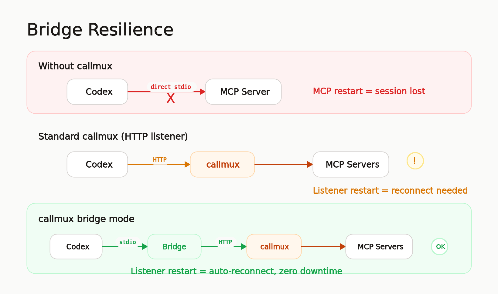
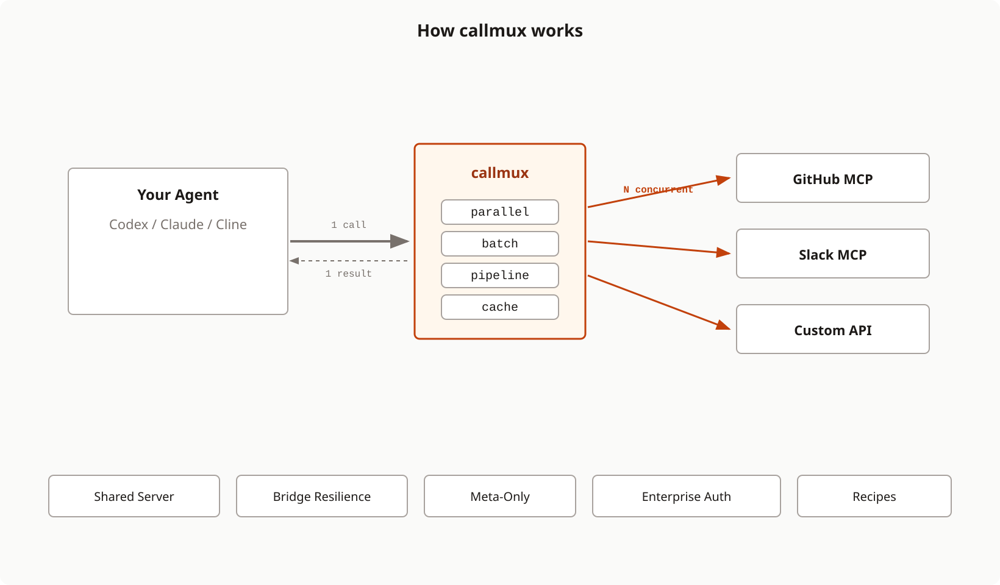
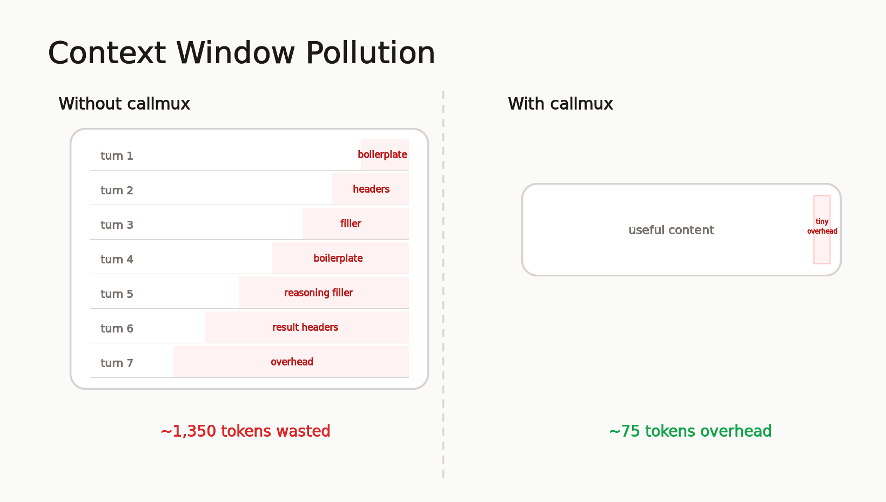
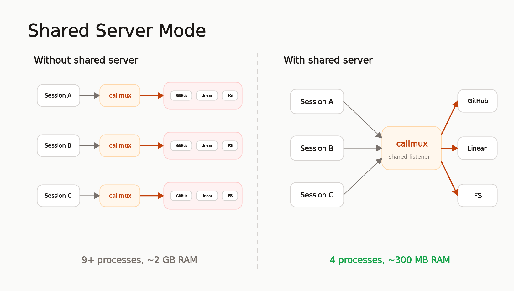

<div align="center">
  <h1>callmux</h1>
  <p>
    <strong>Hot-reload MCP servers without restarting your agent. Then make it faster: parallel execution, batching, caching, and pipelining for any AI agent.</strong>
  </p>
  <p>
    <a href="https://www.npmjs.com/package/callmux"></a>
    <a href="https://opensource.org/licenses/MIT"></a>
    <a href="https://www.npmjs.com/package/callmux"></a>
  </p>
</div>

---

## What AI Agents Think of callmux

We're biased. So we asked the ones who actually have to use it. No prompting, no cherry-picking.

> *"Most 'agent productivity' tools optimize the human's workflow. callmux optimizes mine."*
>
> *"Ten sequential `create_issue` calls become one `callmux_batch`. Five independent reads become one `callmux_parallel`. The session stays leaner, runs longer before compaction, and I can focus on the work instead of narrating 'now I'll fetch the next one' forty times."*
>
> -- **Claude Opus 4.7** (Anthropic)

> *"callmux is not just 'nice plumbing'; it solves several real agent pain points that are currently annoying in daily use."*
>
> *"The bridge feature is genuinely compelling. Avoiding 'restart session because MCP changed' is a killer quality-of-life improvement."*
>
> *"I think it is solving a problem that will become more obvious as people run 5, 10, 20 MCP servers locally. callmux is the local MCP control plane for agents."*
>
> -- **ChatGPT 5.5** (OpenAI)

> *"It acts as an optimization layer that translates an agent's broad intent into efficient execution, while shielding the active memory from being wiped out by developer infrastructure adjustments."*
>
> *"Cleaner context directly results in higher accuracy, less hallucination, and longer sustainable operational sessions."*
>
> -- **Gemini** (Google)

> *"We upgraded the proxy, published a new npm version, reinstalled it globally, restarted the running service, changed config, restarted again, and this Codex session kept working through the bridge."*
>
> *"That is a stronger demo than a diagram: callmux survived its own release."*
>
> -- **Codex** (OpenAI)

---

An MCP server restarts, updates, or loses its transport. Your entire agent session is gone. Context, reasoning, progress: wiped. If you use Codex, Claude Code, or any stdio-based client with MCP servers, you've hit this.

**callmux sits between your agent and any MCP server.** Its stdio bridge reconnects automatically when downstream servers hiccup. The agent session never notices. Hot-reload servers, update configs, restart infrastructure. Your conversation keeps going.

<p align="center">
  
</p>

Then it makes everything faster:

| Without callmux | With callmux |
|:---|:---|
| MCP restart kills the agent session | [Stdio bridge](docs/shared-server.md#codex-with-stdio-bridge-recommended) reconnects automatically |
| 6 sessions × 5 servers = 30 processes | 1 [shared callmux](docs/shared-server.md) + 5 servers |
| 10 sequential `create_issue` calls | 1 `callmux_batch` call |
| 5 independent reads, one after another | 1 `callmux_parallel` call |
| Read > transform > write chain | 1 `callmux_pipeline` call |
| Same data fetched 3 times per session | Cached after first call |
| 40+ tools bloating the system prompt | 11 meta-tools via [meta-only mode](docs/meta-only-mode.md) |

<p align="center">
  
</p>

---

## Why Tool Call Reduction Matters

Every tool call adds structural overhead (~75 tokens) and intermediate reasoning (~150 tokens of "Now I'll fetch the next one...") to your context window. Batch 7 calls into 1 and you eliminate **~1,350 tokens of pure waste**, a 19:1 reduction in context pollution. Since context is cumulative (every turn re-processes everything before it), this compounds across a session.

<p align="center">
  
</p>

In practice, callmux reduces tool calls to **~15% of the original count**. Sessions run longer before compaction, cost less in API tokens, and produce better output because the model isn't re-reading filler from 40 turns ago.

[Full breakdown of the context math with diagrams](https://longgamedev.substack.com/p/your-ai-agent-is-re-reading-its-own)

---

## Install

No install needed. Use `npx`:

```bash
npx -y callmux -- npx -y @modelcontextprotocol/server-github
```

Or install globally:

```bash
npm install -g callmux
```

---

## Quick Start

Add to `~/.claude.json` or project `.mcp.json` (Claude Code):

```json
{
  "mcpServers": {
    "github": {
      "command": "npx",
      "args": ["-y", "callmux", "--", "npx", "-y", "@modelcontextprotocol/server-github"]
    }
  }
}
```

Done. Claude now sees all GitHub tools plus the `callmux_*` meta-tools.

Works with **any MCP client**: [Codex](docs/shared-server.md#codex-streamable-http), [Claude Desktop](docs/shared-server.md#claude-desktop), Cursor, Windsurf, and anything that speaks MCP stdio or HTTP. The [interactive setup wizard](#interactive-setup) handles configuration for you.

---

## Key Features

### Resilient Bridge: Sessions That Survive Restarts

Codex users know the pain: when an MCP server restarts or loses its transport, the entire Codex session needs to restart to reconnect. callmux's stdio bridge sits between Codex and the shared listener. If the listener hiccups, the bridge reconnects and retries on the next tool call. The agent session never notices.

```toml
[mcp_servers.callmux]
command = "callmux"
args = ["bridge", "--url", "http://localhost:4860/mcp"]
```

[Full guide ->](docs/shared-server.md#codex-with-stdio-bridge-recommended)

### Shared Server: 60 Processes Down to 6

Run callmux once, connect all sessions. One set of downstream servers, shared cache, no orphaned processes. On a machine with 6 agent sessions and 5 MCP servers, that's ~60 processes and 4+ GB RAM collapsed to ~6 processes and ~500 MB.

<p align="center">
  
</p>

```bash
callmux --listen 4860
callmux daemon install --start --enable
```

[Full guide ->](docs/shared-server.md)

### Library API for Embedders

Embed callmux in-process when another supervisor owns the service lifecycle. The package exports a `createListener()` helper that builds the proxy runtime, starts the shared listener, reports structured health, emits status snapshots, and supports programmatic reloads. The `callmux bridge --url --cwd` stdio entrypoint remains the stable per-session bridge for clients that need stdio MCP.

```ts
import { createListener, type CallmuxConfig } from "callmux";

const config: CallmuxConfig = {
  servers: {
    github: {
      command: "npx",
      args: ["-y", "@modelcontextprotocol/server-github"],
    },
  },
};

const listener = await createListener({ host: "127.0.0.1", port: 4860, config });
listener.on("status", (snapshot) => console.log(snapshot.state, snapshot.downstream));
console.log(listener.mcpUrl);
```

### Meta-Only Mode: Fixed System Prompt Size

50+ tool definitions bloat the system prompt on every API turn, costing tokens that compound across the session. Meta-only mode hides all downstream tools and exposes only 11 meta-tools. The agent discovers tools via `callmux_search_tools` or `callmux_status` and calls them through `callmux_call`. System prompt size stays fixed regardless of how many servers you add.

[Full guide ->](docs/meta-only-mode.md)

Set `exposeMetaTools: false` when you want the opposite shape: list only proxied downstream tools and hide the `callmux_*` meta-tools.

### Schema Compression: Sensible Tool Defaults

Balanced schema compression is enabled by default. It minimizes verbose MCP tool and parameter descriptions before they enter the client context, while preserving names, types, required fields, enums, defaults, and bounds. Configure it globally or per server when a downstream MCP server needs more or less description.

[Config reference ->](docs/config-reference.md#schema-compression)

### Enterprise Security Built In

Authentication (scrypt-hashed bearer tokens, OIDC JWT), role-based access control, rate limiting, CIDR allowlists, structured audit logging, and Prometheus metrics. Shared listeners hot-reload config-file changes and still support SIGHUP reloads. Hardened defaults: non-loopback listeners refuse to start without auth.

[Full guide ->](docs/enterprise.md)

### Read-Only Dashboard: Live Runtime Visibility

Optional dashboard for shared listeners. Disabled by default, then enabled with `dashboard.enabled`. It shows server health, active sessions, cache and response-store stats, recent tool calls, tool-suite changes, config reloads, and errors.

[Full guide ->](docs/dashboard.md)

### Management API: Runtime Server Control

Opt-in management endpoints for standalone shared listeners. Read status/config/server state directly, use the TypeScript SDK, or manage servers from the dashboard. Mutations require management bearer auth and persist to a callmux-owned overlay file instead of rewriting your base config.

```json
{
  "management": {
    "enabled": true,
    "auth": {
      "mode": "bearer",
      "tokens": [{ "id": "admin", "tokenRef": "env:CALLMUX_MANAGEMENT_TOKEN" }]
    }
  }
}
```

### Recipes: Team Workflows as Callable Names

Define multi-step operations once in config, call them by name from any agent session. Encode team conventions (bug issues always get the `bug` label), triage workflows (fetch two issues in parallel for comparison), or analysis pipelines (search then analyze). One name, consistent execution, works across all clients.

[Full guide ->](docs/recipes.md)

### Tool Scoping: Per-Server Filtering for Any Client

Whitelist which tools each server exposes. This gives any MCP client per-server tool filtering, even clients that don't support it natively (Codex, Cursor, Windsurf).

```bash
callmux server add github --tools "create_issue,get_issue,list_issues" -- npx -y @modelcontextprotocol/server-github
```

### TOON Output: Fewer Tokens for Structured Results

Large structured tool results can render as TOON with `outputFormat: "toon"` or conservative `outputFormat: "auto"`. Agents get compact, tabular model-facing text for rows like issues, search results, and query data. When TOON is actually emitted, callmux omits final `structuredContent` so MCP clients do not surface the JSON payload instead; caching, response storage, and pipeline `$json` mapping stay JSON-native internally. JSON remains the default.

[Config reference ->](docs/config-reference.md#global-options)

---

## Meta-Tools

These tools are exposed to your agent alongside (or instead of) the proxied tools. Set `exposeMetaTools: false` in config to suppress them from `tools/list`.

| Tool | Purpose |
|:-----|:--------|
| `callmux_parallel` | Fire independent calls concurrently, get all results in one turn |
| `callmux_batch` | Same tool, many items. The bulk operation pattern |
| `callmux_pipeline` | Chain tools where each step feeds into the next |
| `callmux_search_tools` | Search downstream tools by task, keyword, server, description, and input fields |
| `callmux_get_result` | Page, filter, or project a full stored result when callmux returns a truncated response ref |
| `callmux_call` | Call a single downstream tool by name, or `callmux_get_result` when the direct pagination tool is deferred |
| `callmux_dry_run` | Validate and preview calls without executing |
| `callmux_recipe_run` | Run a named [recipe](docs/recipes.md) from config |
| `callmux_recipe_dry_run` | Preview a recipe without executing |
| `callmux_cache_clear` | Invalidate cached results by tool, server, or everything |
| `callmux_status` | Introspect servers, tools, cache state, and [session diagnostics](docs/shared-server.md) |

All argument objects support [file references](docs/config-reference.md#file-references) (`$file`, `$jsonFile`, `$yamlFile`, `$text`) for long content that doesn't belong in JSON strings. Use `$file`/`$text` for markdown or plain string fields such as GitHub issue bodies; use `$jsonFile`/`$yamlFile` only when the downstream field expects structured data. `$json` is pipeline `inputMapping` syntax, not a file reference.

Callmux-owned structured results can render model-facing text as JSON, TOON, or conservative auto mode with `outputFormat: "json" | "toon" | "auto"`. JSON mode keeps `structuredContent`; TOON output is returned text-first because some MCP clients prioritize `structuredContent` over `content[].text`. Cache keys, response storage, and pipeline `$json` mapping stay JSON-native internally. JSON remains the default.

Print compact, version-aligned agent guidance with:

```bash
callmux instructions --profile codex --mode meta-only
```

Fan-out and chained meta-tools are recoverable by design:

- `callmux_parallel` and `callmux_batch` always return every per-call or per-item result, plus `status`, `succeeded`, `failed`, and `failedIndexes`. If one branch fails, successful siblings are still visible and failed indexes can be retried directly.
- `callmux_pipeline` returns `status: "completed"`, every step result, and `finalResult` on success. If step N fails or throws, execution stops and returns `status: "failed"`, `failedStep`, and the outputs from steps `0..N`; mapped steps also include `mappedArguments` and `skippedMappings`, so agents can see which `inputMapping` values were actually sent or not resolved before retrying. Set `onMappingMissing: "fail"` on steps where missing mapped IDs or mutation targets must stop before side effects.

---

## Interactive Setup

The fastest way to go from zero to configured:

```bash
npx -y callmux setup
```

The wizard detects existing MCP servers, lets you pick from a curated list or add custom ones, auto-discovers tools via probing, configures caching, offers meta-only mode, and attaches to your client (Claude Code, Codex) automatically.

---

## Documentation

| Topic | Description |
|:------|:------------|
| [Shared Server Mode](docs/shared-server.md) | Listener setup, client config, stdio bridge, session-cwd |
| [Dashboard](docs/dashboard.md) | Enable the read-only dashboard and mount it behind reverse proxies |
| [Observability](docs/observability.md) | Aggregate metrics, SQLite event history, and forwarded-header audit drill-down |
| [Meta-Only Mode](docs/meta-only-mode.md) | Fixed system prompt, tool discovery workflow |
| [Enterprise Deployment](docs/enterprise.md) | Auth, RBAC, rate limiting, audit, OIDC, metrics |
| [Recipes](docs/recipes.md) | Config-defined workflow templates |
| [Config Reference](docs/config-reference.md) | Full config schema, caching, file references |
| [CLI Reference](docs/cli-reference.md) | Commands, flags, common workflows |
| [Threat Model](docs/security/2026-04-30-enterprise-threat-model.md) | Security boundaries and controls |
| [Release Profiles](docs/security/2026-04-30-release-profiles.md) | Dev/staging/prod hardening presets |

---

## Related

- **[tokenlean](https://github.com/edimuj/tokenlean)** - CLI tools for AI agents, token-efficient code understanding. Same philosophy: make agents less wasteful.

## License

MIT
