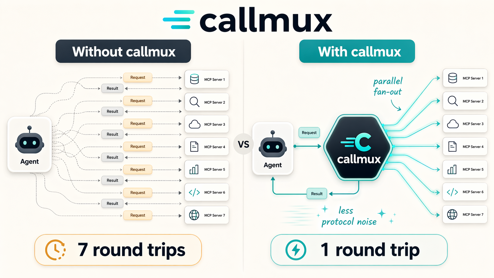

<div align="center">
  <h1>callmux</h1>
  <p>
    <strong>Parallel execution, batching, caching, pipelining, and tool management for any MCP server.</strong>
  </p>
  <p>
    <a href="https://www.npmjs.com/package/callmux"></a>
    <a href="https://opensource.org/licenses/MIT"></a>
    <a href="https://www.npmjs.com/package/callmux"></a>
  </p>
</div>

---

AI agents make tool calls one at a time. Creating 10 GitHub issues? That's 10 sequential round-trips. Fetching data from 3 different servers? 3 serial waits.

**callmux sits between your agent and any MCP server**, adding capabilities the original doesn't have:

| Without callmux | With callmux |
|:---|:---|
| 10 sequential `create_issue` calls | 1 `callmux_batch` call |
| 5 independent reads, one after another | 1 `callmux_parallel` call |
| Read > transform > write chain | 1 `callmux_pipeline` call |
| Same data fetched 3 times per session | Cached after first call |
| 40+ tools bloating the system prompt | 9 meta-tools via meta-only mode |
| 6 sessions × 5 servers = 30 processes | 1 shared callmux + 5 servers |

<p align="center">
  
</p>

## Why Tool Call Reduction Matters

Every tool call adds structural overhead (~75 tokens) and intermediate reasoning (~150 tokens of "Now I'll fetch the next one...") to your context window. Batch 7 calls into 1 and you eliminate **~1,350 tokens of pure waste** -- a 19:1 reduction in context pollution. Since context is cumulative (every turn re-processes everything before it), this compounds across a session.

In practice, callmux reduces tool calls to ~15% of the original count. Sessions run longer before compaction, cost less in API tokens, and produce better output because the model isn't re-reading filler from 40 turns ago.

On machines running multiple agent sessions, callmux's [shared server mode](#shared-server-mode) collapses the process sprawl: one callmux instance serves all sessions, eliminating duplicate downstream servers and sharing the cache across every connected client.

[Deep dive on the context math with diagrams](https://longgamedev.substack.com/p/your-ai-agent-is-re-reading-its-own)

---

## Features

- **Parallel execution** -- fire independent tool calls concurrently, get all results in one turn
- **Batch operations** -- same tool, many items, one call (bulk create, bulk fetch)
- **Pipelining** -- chain tools where each step feeds into the next via input mapping
- **Caching** -- TTL-based result cache with wildcard allow/deny policies, per-server overrides
- **Meta-only mode** -- hide all downstream tools from the agent's listing, expose only 9 meta-tools. Keeps the system prompt fixed-size regardless of how many servers you connect
- **Multi-server** -- wrap multiple MCP servers through one callmux instance with automatic namespacing
- **Tool scoping** -- whitelist which tools each server exposes. Gives any MCP client per-server tool filtering, even if the client doesn't support it natively (Codex, Cursor, Windsurf, etc.)
- **Shared server mode** -- run callmux once with `--listen <port>`, connect all sessions via URL. One set of downstream servers shared across every agent session on the machine
- **Per-server concurrency** -- protect fragile downstreams with per-server call limits alongside the global concurrency cap
- **Degraded startup** -- servers that fail to connect are skipped instead of blocking startup, with full diagnostics in `callmux_status`
- **Multi-transport** -- local stdio, Streamable HTTP, and SSE with auto-fallback
- **Config schema** -- JSON Schema for editor autocomplete and validation (`$schema` auto-injected)
- **Zero config** -- wrap any server with one `npx` command, or use the interactive setup wizard

---

## Install

No install needed. Use `npx`:

```bash
npx -y callmux -- npx -y @modelcontextprotocol/server-github
```

Or install globally:

```bash
npm install -g callmux
```

## Quick Start

### Claude Code

Add to `~/.claude.json` or project `.mcp.json`:

```json
{
  "mcpServers": {
    "github": {
      "command": "npx",
      "args": ["-y", "callmux", "--", "npx", "-y", "@modelcontextprotocol/server-github"]
    }
  }
}
```

Done. Claude now sees all GitHub tools plus the `callmux_*` meta-tools.

<details>
<summary><strong>More:</strong> tool filtering, caching, env vars, multi-server</summary>

**Filter tools and enable caching:**

```json
{
  "mcpServers": {
    "github": {
      "command": "npx",
      "args": [
        "-y", "callmux",
        "--tools", "create_issue,get_issue,list_issues,search_issues",
        "--env", "GITHUB_TOKEN=ghp_xxx",
        "--cache", "60",
        "--cache-allow", "get_*,list_*,search_*",
        "--", "npx", "-y", "@modelcontextprotocol/server-github"
      ]
    }
  }
}
```

**Multiple servers via config file:**

Create `~/.config/callmux/config.json` (or run `callmux setup`):

```json
{
  "$schema": "https://raw.githubusercontent.com/edimuj/callmux/main/schema.json",
  "servers": {
    "github": {
      "command": "npx",
      "args": ["-y", "@modelcontextprotocol/server-github"],
      "env": { "GITHUB_TOKEN": "ghp_xxx" },
      "tools": ["create_issue", "get_issue", "list_issues", "search_issues"]
    },
    "linear": {
      "command": "npx",
      "args": ["-y", "@linear/mcp-server"],
      "env": { "LINEAR_API_KEY": "lin_api_..." }
    }
  },
  "cacheTtlSeconds": 60,
  "maxConcurrency": 20
}
```

Then in your MCP config:

```json
{
  "mcpServers": {
    "callmux": {
      "command": "npx",
      "args": ["-y", "callmux"]
    }
  }
}
```

callmux auto-discovers `~/.config/callmux/config.json`. With multiple servers, tools are namespaced: `github__create_issue`, `linear__list_issues`.

</details>

---

### Codex

Add to `~/.codex/config.toml`:

```toml
[mcp_servers.github]
command = "npx"
args = ["-y", "callmux", "--", "npx", "-y", "@modelcontextprotocol/server-github"]
```

Or use the Codex CLI:

```bash
codex mcp add github -- npx -y callmux -- npx -y @modelcontextprotocol/server-github
```

<details>
<summary><strong>More:</strong> tool filtering, caching, env vars, multi-server</summary>

```toml
[mcp_servers.github]
command = "npx"
args = [
  "-y", "callmux",
  "--tools", "create_issue,get_issue,list_issues,search_issues",
  "--env", "GITHUB_TOKEN=ghp_xxx",
  "--cache", "60",
  "--cache-allow", "get_*,list_*,search_*",
  "--", "npx", "-y", "@modelcontextprotocol/server-github"
]
```

**Multi-server:**

```toml
[mcp_servers.callmux]
command = "npx"
args = ["-y", "callmux", "--config", "/Users/you/.config/callmux/config.json"]
```

The Codex macOS app, CLI, and IDE extension all share `~/.codex/config.toml`. Project-scoped overrides go in `.codex/config.toml`.

</details>

---

### Claude Desktop (Mac / Windows)

Add to your `claude_desktop_config.json`:

- **macOS:** `~/Library/Application Support/Claude/claude_desktop_config.json`
- **Windows:** `%APPDATA%\Claude\claude_desktop_config.json`

```json
{
  "mcpServers": {
    "callmux": {
      "command": "npx",
      "args": ["-y", "callmux", "--", "npx", "-y", "@modelcontextprotocol/server-github"]
    }
  }
}
```

<details>
<summary><strong>More:</strong> PATH issues, multi-server</summary>

The Claude desktop app has a minimal PATH. If `npx` isn't found, use the full path (e.g., `/usr/local/bin/npx`). Find it with `which npx`. Or install globally and use `"command": "callmux"` directly.

Multi-server works the same way as Claude Code. Point at a config file or let auto-discovery find it.

</details>

---

## Interactive Setup

The fastest way to go from zero to configured:

```bash
npx -y callmux setup
```

The wizard walks you through:
1. **Detects existing MCP servers** from `.mcp.json`, `~/.claude.json`, and Claude Desktop config, then offers to import them
2. **Pick servers** from a curated list (GitHub, Linear, Slack, Filesystem, etc.) or add custom (local command or remote URL)
3. **Auto-discovers tools** by probing each server, then lets you pick which to expose
4. **Configures caching** with sensible defaults
5. **Offers meta-only mode** to hide proxied tools and reduce system prompt size
6. **Chooses client connection mode**: local command per client or shared listener URL
7. **Attaches to your client** (Claude Code, Codex) automatically

---

## Meta-Tools

These are exposed to your agent alongside the proxied tools:

### `callmux_parallel`

Execute multiple independent tool calls concurrently.

```json
{
  "calls": [
    { "tool": "get_issue", "arguments": { "number": 1 } },
    { "tool": "get_issue", "arguments": { "number": 2 } },
    { "tool": "get_issue", "arguments": { "number": 3 } }
  ]
}
```

### `callmux_batch`

Same tool, many items. The bulk operation pattern.

```json
{
  "tool": "create_issue",
  "items": [
    { "arguments": { "title": "Bug A", "labels": ["bug"] } },
    { "arguments": { "title": "Bug B", "labels": ["bug"] } }
  ]
}
```

### `callmux_pipeline`

Chain tools where each step feeds into the next.

```json
{
  "steps": [
    { "tool": "search_issues", "arguments": { "query": "is:open label:bug" } },
    { "tool": "analyze", "arguments": {}, "inputMapping": { "data": "$json" } }
  ]
}
```

### `callmux_dry_run`

Validate and preview calls without executing downstream tools. Resolves routing and argument references (`$file`, `$jsonFile`, `$yamlFile`, `$text`), then returns planned calls, cache-hit candidates, and per-call errors.

```json
{
  "mode": "parallel",
  "calls": [
    { "tool": "github__create_issue", "arguments": { "title": "A" } },
    { "tool": "github__create_issue", "arguments": { "title": "B" } }
  ]
}
```

### `callmux_recipe_run`

Run a named recipe from config. Recipes expand into the existing call, parallel, batch, or pipeline meta-tools and can substitute runtime arguments with structured placeholders.

```json
{
  "recipe": "open_bug",
  "arguments": {
    "title": "Crash on startup",
    "body": "Steps to reproduce..."
  }
}
```

### `callmux_recipe_dry_run`

Preview a named recipe without executing downstream tools.

```json
{
  "recipe": "open_bug",
  "arguments": {
    "title": "Crash on startup",
    "body": "Steps to reproduce..."
  }
}
```

### `callmux_cache_clear`

Invalidate cached results. Scope by tool, server, or clear everything.

```json
{ "tool": "get_issue", "server": "github" }
```

### `callmux_call`

Call a single downstream tool by name. Primary invocation path in [meta-only mode](#meta-only-mode).

```json
{ "tool": "get_issue", "server": "github", "arguments": { "number": 42 } }
```

If `server` is wrong, callmux now returns a structured `tool_resolution_failed` error with the instance identity and available server names for faster rerouting.

#### File References For Long String Arguments

Any argument object can use a `$file` reference. callmux reads the file and replaces the object with file content before forwarding to the downstream MCP tool:

```json
{
  "tool": "github__create_issue",
  "arguments": {
    "title": "Stream A: Whistleblower",
    "body": { "$file": "/tmp/stream-a-body.md" }
  }
}
```

Optional `maxBytes` override is supported per reference:

```json
{
  "body": { "$file": "/tmp/stream-a-body.md", "maxBytes": 2000000 }
}
```

Defaults:
- `maxBytes` defaults to `1000000` (1 MB) when omitted.
- Hard cap for `maxBytes` is `10000000` (10 MB).

For structured arguments, use parsed file references:
- `{"$jsonFile":"/tmp/payload.json"}`
- `{"$yamlFile":"/tmp/payload.yaml"}`

Both support optional `maxBytes` like `$file`.

#### Inline Text Composition (No File Write Step)

For long multi-line text where you want to skip writing a temp file, use `$text`:

```json
{
  "tool": "github__create_issue",
  "arguments": {
    "title": "Stream B",
    "body": {
      "$text": {
        "lines": [
          "## Summary",
          "",
          "| Field | Value |",
          "| --- | --- |",
          "| A | B |"
        ]
      }
    }
  }
}
```

`$text` forms:
- `{"$text":"literal string"}`
- `{"$text":{"lines":["line1","line2"],"join":"\n"}}` (`join` defaults to newline)

Like `$file`, `$text` is resolved by callmux before forwarding, so downstream MCP servers receive a normal string.

### `callmux_status`

Introspect callmux from inside your agent. Shows instance identity (`instanceId`, optional `namespace`), wrapped server names, failed startup servers, available tools, cache state, mode, and lightweight `recommendations` for choosing the right meta-tool. Pass `descriptions: true` for tool discovery in meta-only mode. In shared listener mode, pass `sessions: true` to include active session cwd diagnostics and scoped stdio client state.

```json
{ "server": "github", "descriptions": true, "descriptionMaxLength": 80, "recommendations": true, "sessions": true }
```

Set `"recommendations": false` to omit guidance from status responses when you need the smallest payload.

If you run multiple callmux instances in one session, set `CALLMUX_NAMESPACE` on each process (for example `mcp__server1__`, `mcp__callmux__`) so errors and status output clearly identify which instance handled a call.

---

## Multi-Server Mode

Wrap multiple MCP servers through a single callmux instance. Tools are automatically namespaced (`github__create_issue`, `linear__list_issues`) and the `server` field in meta-tool calls lets you target specific servers:

```json
{
  "calls": [
    { "server": "github", "tool": "get_issue", "arguments": { "number": 42 } },
    { "server": "linear", "tool": "get_issue", "arguments": { "id": "ENG-123" } }
  ]
}
```

## Remote Servers (HTTP/SSE)

callmux can connect to remote MCP servers over HTTP, not just local stdio processes. Use `url` instead of `command`:

```json
{
  "servers": {
    "local-github": {
      "command": "npx",
      "args": ["-y", "@modelcontextprotocol/server-github"]
    },
    "remote-api": {
      "url": "https://mcp.example.com/mcp",
      "headers": { "Authorization": "Bearer sk-..." }
    }
  }
}
```

Transport is auto-detected: callmux tries Streamable HTTP first (the current MCP spec), then falls back to SSE for older servers. Force a specific transport with `"transport": "sse"` or `"transport": "streamable-http"`.

Startup is degraded by default: if one downstream server fails to connect, callmux still starts with the healthy servers and reports failures in `callmux_status.failedServers`. Set `"strictStartup": true` or pass `--strict-startup` to fail startup when any downstream server fails.

Startup connect/list-tools work and downstream calls both have finite timeouts. Configure with `connectTimeoutMs` and `callTimeoutMs`, or inline flags `--connect-timeout <ms>` and `--call-timeout <ms>`.

Inbound request payload size defaults to `1048576` bytes (1 MiB) in listener mode. Configure globally with `requestBodyMaxBytes`, override per downstream server with `servers.<name>.requestBodyMaxBytes`, or disable with `0`. Optional per-request overrides are available via `x-callmux-max-body-bytes` when `allowRequestBodyMaxOverride` is enabled.

Listener auth supports static bearer tokens:

- `auth.mode = "bearer"`
- `auth.tokens = [{ id, hash }]` (recommended)
- `auth.tokens = [{ id, hashRef: "env:CALLMUX_HASH" }]` (secret adapters)
- `auth.tokens = [{ id, hashRef: "file:./secrets/callmux.hash" }]` (secret adapters)
- `auth.tokens = [{ id, token }]` (legacy migration mode)
- optional `auth.allowUnauthenticatedHealth = true`

`hashRef`/`tokenRef` secret references currently support:

- `env:<VARIABLE_NAME>`
- `file:<PATH>` (relative paths resolve from the config file directory)

`tokenRef` values are converted to in-memory scrypt hashes at config load time.

Generate a scrypt hash for config values:

```bash
node --input-type=module -e 'import { scryptSync, randomBytes } from "node:crypto"; const t=process.argv[1]; if(!t){ throw new Error("token required"); } const N=16384,r=8,p=1; const salt=randomBytes(16); const maxmem=256*N*r+1048576; const dk=scryptSync(t, salt, 32, { N, r, p, maxmem }); console.log(["scrypt",N,r,p,salt.toString("base64url"),dk.toString("base64url")].join("$"));' "replace-with-token"
```

`callmux doctor` now flags plaintext `auth.tokens[].token` values so you can migrate safely.

Listener auth also supports OIDC JWT validation:

- `auth.mode = "oidc_jwt"`
- `auth.issuer` and `auth.audience` claims are validated
- signatures are verified via `auth.jwksUri`
- optional controls: `auth.algorithms`, `auth.clockSkewSeconds`, `auth.jwksCacheTtlSeconds`, `auth.jwksFetchTimeoutMs`

When binding `--listen` to a non-loopback host, callmux now fails startup if auth is missing unless `allowInsecureRemoteListener=true` (or `--allow-insecure-remote-listener`) is explicitly set.

**Inline mode** for a single remote server:

```bash
npx -y callmux --url https://mcp.example.com/mcp --header "Authorization:Bearer sk-..."
```

---

## Shared Server Mode

Every MCP client session spawns its own callmux + downstream servers. With 6 concurrent Claude Code sessions each connecting to 5 MCP servers, that's **~60 processes and 4+ GB RAM** for what could be 6.

Run callmux once as a persistent server, connect all sessions to it:

```bash
callmux --listen 4860
```

```
                     ┌─ GitHub MCP (1 instance)
callmux (port 4860) ─┼─ Linear MCP (1 instance)
   HTTP listener     ├─ Filesystem MCP (1 instance)
        ↑            └─ Custom server (1 instance)
        │
   ┌────┼────┬────┐
   │    │    │    │
 ses1  ses2  ses3  ses4  (connect via URL)
```

**Benefits:**
- ~60 processes → ~6 (one callmux + one of each downstream)
- ~4 GB → ~500 MB RAM for MCP infrastructure
- No orphaned servers when sessions die (one process, clean lifecycle)
- Cache shared across sessions when safe, and scoped by project cwd for cwd-sensitive calls
- Downstream startup cost paid once

For stdio servers in listener mode, callmux uses the client session's project cwd by default when it can resolve one from MCP roots, `x-callmux-cwd`, or request `_meta`. This makes relative paths behave like they would in a per-project MCP process. Session-cwd stdio clients are reused per `server + cwd` and retired after `sessionCwdIdleTtlSeconds` of inactivity. If a stdio server should always run from the configured/process cwd, set `cwdMode: "global"` for that server.

**Client config (shared server):**

Generate ready-to-use client snippets:

```bash
callmux client print codex --url http://localhost:4860/mcp
callmux client print codex --url http://localhost:4860/mcp --bridge
callmux client print claude --url http://localhost:4860/sse
```

**Codex** (Streamable HTTP):

```toml
[mcp_servers.callmux]
url = "http://localhost:4860/mcp"
```

If your Codex MCP client does not send MCP roots or a project cwd to HTTP servers, use the stdio bridge instead. Codex starts one lightweight bridge per project session; the bridge connects to the shared listener and sends `x-callmux-cwd` from its process cwd, so wrapped path-sensitive stdio servers still see the project cwd:

```toml
[mcp_servers.callmux]
command = "callmux"
args = ["bridge","--url","http://localhost:4860/mcp"]
```

**Claude Code** (legacy SSE transport):

```json
{
  "mcpServers": {
    "callmux": { "url": "http://localhost:4860/sse" }
  }
}
```

callmux supports both Streamable HTTP (`/mcp`) and legacy SSE (`/sse`). The `/health` endpoint reports server status and active session count, and `/metrics` exposes Prometheus metrics when enabled.

In shared listener mode launched from a config file (`--config` or autodiscovered config), you can hot-reload runtime security settings with `SIGHUP`:

```bash
kill -HUP <callmux-pid>
```

Reload is intentionally non-structural. Changes to servers/tool wiring are ignored until full restart, while runtime controls are reloaded:

- `auth`
- `authorization`
- `abuseControls`
- `auditLog`
- `metrics`
- `requestBodyMaxBytes`
- `allowRequestBodyMaxOverride`
- `allowInsecureRemoteListener`

By default, binds to `127.0.0.1` (localhost only). Use `--host 0.0.0.0` to expose on all interfaces (e.g., for Tailscale access from other machines).

---

## Meta-Only Mode

By default, callmux exposes all downstream tools alongside its meta-tools. With multiple servers this can mean 50-100+ tool definitions in the system prompt on every API turn.

**Meta-only mode** hides all proxied tools and exposes only the 9 meta-tools (`callmux_parallel`, `callmux_batch`, `callmux_pipeline`, `callmux_call`, `callmux_dry_run`, `callmux_recipe_run`, `callmux_recipe_dry_run`, `callmux_cache_clear`, `callmux_status`). The agent discovers available tools via `callmux_status` and invokes them through `callmux_call`, recipes, or the batch/parallel meta-tools.

```json
{
  "servers": { "github": { "command": "npx", "args": ["-y", "@modelcontextprotocol/server-github"] } },
  "metaOnly": true,
  "descriptionMaxLength": 80
}
```

| | Standard mode | Meta-only mode |
|:---|:---|:---|
| Tools in listing | All downstream + 9 meta-tools | 9 meta-tools only |
| Single tool call | Direct by name | `callmux_call` |
| Tool discovery | Automatic (in listing) | `callmux_status` with `descriptions: true` |
| System prompt size | Grows with server count | Fixed at 9 tools |

Enable via config (`"metaOnly": true`), CLI flag (`--meta-only`), or the setup wizard.

---

## Caching

Enable with `cacheTtlSeconds` or `--cache <seconds>`. Error results are never cached.

```json
{
  "cacheTtlSeconds": 60,
  "maxCacheEntries": 1000,
  "cachePolicy": {
    "allowTools": ["get_*", "list_*", "search_*"],
    "denyTools": ["get_secret"]
  }
}
```

- **`allowTools`**: only matching tools are cacheable (whitelist)
- **`denyTools`**: matching tools are never cached (blacklist)
- Supports exact names and `*` wildcards
- Per-server policies combine with the global policy
- Oldest cache entries are evicted after `maxCacheEntries` (default: 1000)
- `callmux_cache_clear` invalidates manually

## CLI Management

Manage servers without editing JSON:

```bash
callmux setup                         # interactive wizard
callmux init                          # create config manually
callmux server add github -- npx -y @modelcontextprotocol/server-github
callmux server set github --add-tool search_issues
callmux server test --all
callmux doctor
callmux doctor --url http://localhost:4860/mcp --cwd "$PWD"
callmux client status
callmux client attach claude --yes
callmux client attach codex --url http://localhost:4860/mcp --yes
```

When adding a server without `--tools`, callmux probes it automatically and lets you pick which tools to expose interactively.

<details>
<summary><strong>Full CLI reference</strong></summary>

| Command | Description |
|:--------|:------------|
| `callmux setup` | Interactive setup wizard |
| `callmux init` | Create empty config file |
| `callmux server add <name> [opts] -- <cmd>` | Add a downstream server |
| `callmux server set <name> [opts]` | Modify an existing server |
| `callmux server test <name>\|--all` | Smoke-test connectivity |
| `callmux server list [--json]` | List configured servers |
| `callmux server remove <name>` | Remove a server |
| `callmux doctor [--json]` | Validate config + probe all servers |
| `callmux doctor --url <listener-url> [--cwd <path>] [--header Name:Value] [--json]` | Smoke-test a running shared listener |
| `callmux bridge --url <listener-url> [--cwd <path>] [--header Name:Value]` | Stdio bridge to a shared listener, injecting `x-callmux-cwd` |
| `callmux client status [claude\|codex]` | Check client configuration state |
| `callmux client attach <client> [--yes]` | Write command-mode callmux into client config |
| `callmux client attach <client> --url <listener-url> [--yes]` | Write shared listener URL into client config |
| `callmux client attach <client> --url <listener-url> --bridge [--yes]` | Write stdio bridge config for a shared listener |
| `callmux client detach <client> [--yes]` | Remove callmux from client config |
| `callmux client print <client> [--url <listener-url>] [--bridge]` | Output ready-to-paste snippet |

**Inline flags** (single-server mode):

| Flag | Description |
|:-----|:------------|
| `--tools <list>` | Comma-separated tool whitelist |
| `--env KEY=VALUE` | Environment variable (repeatable) |
| `--cache <seconds>` | Cache TTL |
| `--cache-max-entries <n>` | Max cache entries before oldest entries are evicted |
| `--cache-allow <list>` | Cacheable tool patterns |
| `--cache-deny <list>` | Non-cacheable tool patterns |
| `--concurrency <n>` | Max parallel calls (default: 20) |
| `--connect-timeout <ms>` | Startup connect/list-tools timeout |
| `--call-timeout <ms>` | Downstream tool call timeout |
| `--request-body-max-bytes <n>` | Max inbound request payload bytes (0 = unlimited) |
| `--allow-request-body-override` | Allow `x-callmux-max-body-bytes` per-request override |
| `--allow-insecure-remote-listener` | Allow remote listener startup without auth (unsafe) |
| `--strict-startup` | Fail startup if any downstream server fails |
| `--listen <port>` | Run as shared HTTP/SSE server (multiple clients) |
| `--host <addr>` | Bind address for `--listen` (default: `127.0.0.1`) |
| `--meta-only` | Hide proxied tools, expose only meta-tools |
| `--description-max-length <n>` | Default max chars for tool descriptions in status |
| `--url <url>` | Connect to remote server (instead of `-- command`) |
| `--transport <type>` | Force `streamable-http` or `sse` |
| `--header Name:Value` | HTTP header (repeatable) |

</details>

## Config File

Auto-discovery order:

1. `$CALLMUX_CONFIG` environment variable
2. `~/.config/callmux/config.json`

Works on Linux, macOS, and Windows.

<details>
<summary><strong>Full config schema</strong></summary>

Add `$schema` for editor autocomplete (VS Code, JetBrains, etc.):

```json
{
  "$schema": "https://raw.githubusercontent.com/edimuj/callmux/main/schema.json",
  "servers": {
    "<stdio-server>": {
      "command": "...",
      "args": ["..."],
      "env": { "KEY": "value" },
      "cwd": "/path",
      "cwdMode": "global",
      "tools": ["tool_a", "tool_b"],
      "maxConcurrency": 2,
      "requestBodyMaxBytes": 1048576,
      "cachePolicy": {
        "allowTools": ["get_*"],
        "denyTools": ["get_secret"]
      }
    },
    "<http-server>": {
      "url": "https://...",
      "transport": "streamable-http | sse",
      "headers": { "Authorization": "Bearer ..." },
      "tools": ["tool_a"],
      "maxConcurrency": 5,
      "requestBodyMaxBytes": 0,
      "cachePolicy": { "allowTools": ["*"] }
    }
  },
  "cacheTtlSeconds": 60,
  "cachePolicy": { "denyTools": ["create_*"] },
  "maxConcurrency": 20,
  "maxCacheEntries": 1000,
  "connectTimeoutMs": 30000,
  "callTimeoutMs": 30000,
  "requestBodyMaxBytes": 1048576,
  "allowRequestBodyMaxOverride": false,
  "allowInsecureRemoteListener": false,
  "auth": {
    "mode": "bearer",
    "tokens": [{ "id": "ops", "hash": "scrypt$16384$8$1$<salt>$<derivedKey>" }],
    "allowUnauthenticatedHealth": false
  },
  "authorization": {
    "defaultEffect": "deny",
    "rules": [
      {
        "id": "ops-all",
        "effect": "allow",
        "principals": ["bearer:ops"],
        "tools": ["*"]
      },
      {
        "id": "agents-read",
        "effect": "allow",
        "principals": ["oidc:*", "scope:mcp.read"],
        "tools": ["github__get_*", "github__list_*"]
      }
    ]
  },
  "abuseControls": {
    "globalRequestsPerMinute": 1200,
    "principalRequestsPerMinute": 240,
    "principalMaxInFlight": 20,
    "cidrAllowlist": ["127.0.0.1/32", "::1/128"]
  },
  "auditLog": {
    "enabled": false,
    "includeRequestBody": false,
    "maxPayloadChars": 4096
  },
  "metrics": {
    "enabled": true,
    "path": "/metrics",
    "allowUnauthenticated": false
  },
  "strictStartup": false,
  "metaOnly": false,
  "descriptionMaxLength": 80
}
```

Also accepts MCP-compatible format (`{ "mcpServers": { ... } }`).

**Global options:**

| Field | Type | Default | Description |
|:------|:-----|:--------|:------------|
| `servers` | object | *(required)* | Map of server name → server config |
| `recipes` | object | — | Named reusable callmux workflows |
| `cacheTtlSeconds` | integer | `0` | Cache TTL in seconds (0 = disabled) |
| `cachePolicy` | object | — | Global cache allow/deny rules (see [Caching](#caching)) |
| `maxConcurrency` | integer | `20` | Global max concurrent calls for parallel/batch |
| `connectTimeoutMs` | integer | `30000` | Timeout for downstream startup connect + list-tools |
| `callTimeoutMs` | integer | `30000` | Timeout for downstream tool calls |
| `sessionCwdIdleTtlSeconds` | integer | `600` | Idle TTL for listener-mode session cwd stdio clients (`0` = close after each call) |
| `requestBodyMaxBytes` | integer | `1048576` | Global max inbound request payload bytes (`0` = unlimited) |
| `allowRequestBodyMaxOverride` | boolean | `false` | Allow per-request `x-callmux-max-body-bytes` header override |
| `allowInsecureRemoteListener` | boolean | `false` | Permit non-loopback listener startup without auth (unsafe) |
| `auth` | object | — | Listener authentication config (hashed bearer tokens) |
| `authorization` | object | — | Listener authorization policy (principal + tool rules) |
| `abuseControls` | object | — | Listener abuse controls (rate limits, in-flight caps, CIDR allowlist) |
| `auditLog` | object | — | Structured per-request audit logging with payload redaction |
| `metrics` | object | — | Prometheus metrics endpoint configuration |
| `strictStartup` | boolean | `false` | Fail startup if any server fails to connect |
| `maxCacheEntries` | integer | `1000` | Max cached entries before LRU eviction |
| `metaOnly` | boolean | `false` | Hide proxied tools, expose only meta-tools |
| `descriptionMaxLength` | integer | — | Default max chars for tool descriptions in `callmux_status` |

**Recipes:**

Recipes are config-defined wrappers around the existing meta-tools. Use `{ "$param": "name" }` as an entire JSON value to substitute a runtime argument from `callmux_recipe_run` or `callmux_recipe_dry_run`.

```json
{
  "recipes": {
    "open_bug": {
      "description": "Create a labeled bug issue",
      "mode": "call",
      "server": "github",
      "tool": "create_issue",
      "arguments": {
        "title": { "$param": "title" },
        "body": { "$param": "body" },
        "labels": ["bug"]
      }
    },
    "triage_pair": {
      "mode": "parallel",
      "calls": [
        { "server": "github", "tool": "get_issue", "arguments": { "issue_number": { "$param": "first" } } },
        { "server": "github", "tool": "get_issue", "arguments": { "issue_number": { "$param": "second" } } }
      ]
    }
  }
}
```

**Stdio server config** (local process):

| Field | Type | Required | Description |
|:------|:-----|:---------|:------------|
| `command` | string | yes | Command to launch the MCP server |
| `args` | string[] | — | Arguments passed to the command |
| `env` | object | — | Environment variables for the process |
| `cwd` | string | — | Working directory |
| `cwdMode` | `"global"` or `"session"` | — | Listener-mode cwd behavior. Omit for session/project cwd when available; use `"global"` to force configured/process cwd |
| `tools` | string[] | — | Whitelist of tool names to expose (omit = all) |
| `maxConcurrency` | integer | — | Max concurrent calls to this server |
| `requestBodyMaxBytes` | integer | — | Inbound payload cap for calls targeting this server (`0` = unlimited, omit = global) |
| `cachePolicy` | object | — | Per-server cache allow/deny rules |

**HTTP server config** (remote):

| Field | Type | Required | Description |
|:------|:-----|:---------|:------------|
| `url` | string | yes | URL of the remote MCP server |
| `transport` | string | — | `"streamable-http"` or `"sse"` (auto-detected if omitted) |
| `headers` | object | — | HTTP headers (e.g. authorization) |
| `tools` | string[] | — | Whitelist of tool names to expose (omit = all) |
| `maxConcurrency` | integer | — | Max concurrent calls to this server |
| `requestBodyMaxBytes` | integer | — | Inbound payload cap for calls targeting this server (`0` = unlimited, omit = global) |
| `cachePolicy` | object | — | Per-server cache allow/deny rules |

**Auth config** (listener mode):

Bearer mode:

| Field | Type | Required | Description |
|:------|:-----|:---------|:------------|
| `mode` | string | yes | Must be `"bearer"` |
| `tokens` | object[] | yes | Accepted bearer tokens (`id` + `hash` recommended, legacy `token` supported for migration) |
| `allowUnauthenticatedHealth` | boolean | — | Allow `/health` without auth |

OIDC JWT mode:

| Field | Type | Required | Description |
|:------|:-----|:---------|:------------|
| `mode` | string | yes | Must be `"oidc_jwt"` |
| `issuer` | string | yes | Required `iss` claim value |
| `audience` | string \| string[] | yes | Allowed `aud` claim value(s) |
| `jwksUri` | string | yes | JWKS endpoint for signature verification |
| `algorithms` | string[] | — | Allowed algorithms (`RS256`, `RS384`, `RS512`, `ES256`, `ES384`, `ES512`), default `RS256` |
| `clockSkewSeconds` | integer | — | `exp`/`nbf` clock-skew tolerance (default `30`) |
| `jwksCacheTtlSeconds` | integer | — | JWKS cache TTL (default `300`) |
| `jwksFetchTimeoutMs` | integer | — | JWKS fetch timeout (default `5000`) |
| `allowUnauthenticatedHealth` | boolean | — | Allow `/health` without auth |

**Authorization config** (listener mode):

| Field | Type | Required | Description |
|:------|:-----|:---------|:------------|
| `defaultEffect` | string | — | `allow` or `deny` when no rule matches (default `allow`) |
| `rules` | object[] | yes | Ordered policy rules |

Authorization rule fields:

| Field | Type | Required | Description |
|:------|:-----|:---------|:------------|
| `id` | string | — | Stable rule identifier used in denied responses |
| `effect` | string | yes | `allow` or `deny` |
| `principals` | string[] | — | Principal patterns (`bearer:ops`, `oidc:alice`, `scope:mcp.read`, `group:admins`, wildcard `*`) |
| `tools` | string[] | — | Tool patterns (supports wildcards, including `server__tool` patterns like `github__get_*`) |

If `authorization` is configured, request auth (`auth`) should also be configured so policy can evaluate an authenticated principal.

**Abuse controls** (listener mode):

| Field | Type | Required | Description |
|:------|:-----|:---------|:------------|
| `globalRequestsPerMinute` | integer | — | Max total requests per minute |
| `principalRequestsPerMinute` | integer | — | Max requests per minute per principal |
| `principalMaxInFlight` | integer | — | Max concurrent in-flight requests per principal |
| `cidrAllowlist` | string[] | — | Allowed source CIDR/IP list (`127.0.0.1/32`, `10.0.0.0/8`, `::1/128`) |

When limits are hit, listener endpoints return `429` with `Retry-After` (when rate-window retry is known).

**Audit log** (listener mode):

| Field | Type | Required | Description |
|:------|:-----|:---------|:------------|
| `enabled` | boolean | — | Enable structured JSON audit events (default `false`) |
| `includeRequestBody` | boolean | — | Include redacted payload details when available (default `false`) |
| `maxPayloadChars` | integer | — | Max serialized payload chars in logs (`0` disables payload logging) |
| `redactKeys` | string[] | — | Additional key names to redact (case-insensitive) |

Audit records include correlation `requestId`, principal metadata, status code, and duration.

**Metrics** (listener mode):

| Field | Type | Required | Description |
|:------|:-----|:---------|:------------|
| `enabled` | boolean | — | Enable Prometheus endpoint (default `true`) |
| `path` | string | — | Metrics path (default `/metrics`) |
| `allowUnauthenticated` | boolean | — | Allow unauthenticated access to metrics |

HTTP responses include `x-request-id`, and error payloads include `requestId` for correlation.

Enterprise hardening references:

- Threat model: `docs/security/2026-04-30-enterprise-threat-model.md`
- Release profiles: `docs/security/2026-04-30-release-profiles.md`

</details>

## Related

- **[tokenlean](https://github.com/edimuj/tokenlean)** - CLI tools for AI agents, token-efficient code understanding. Same philosophy: make agents less wasteful.

## License

MIT
